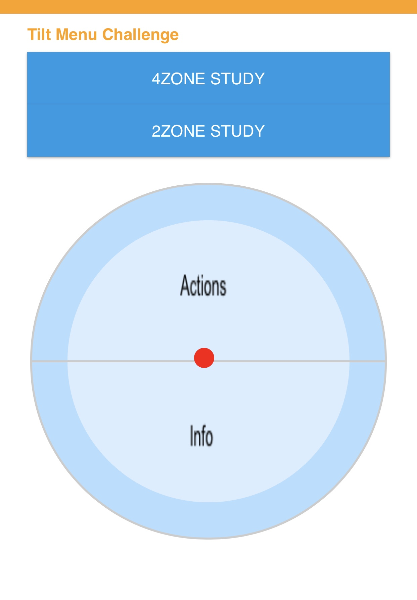
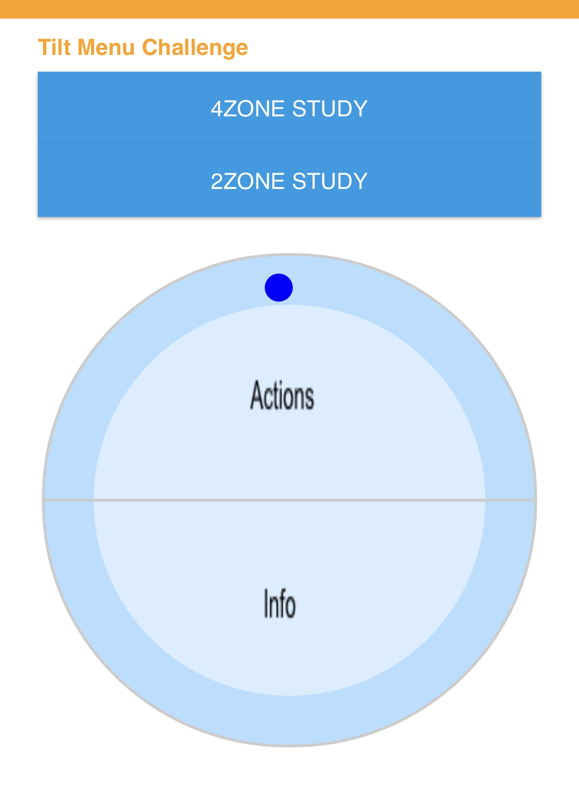
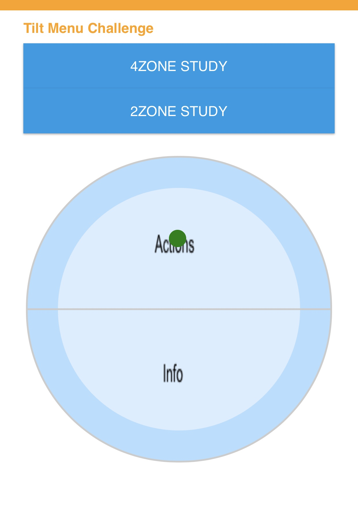
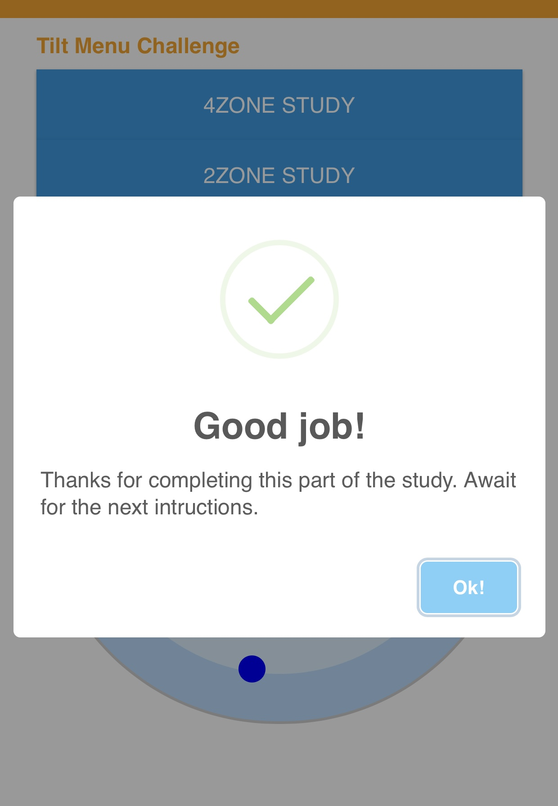
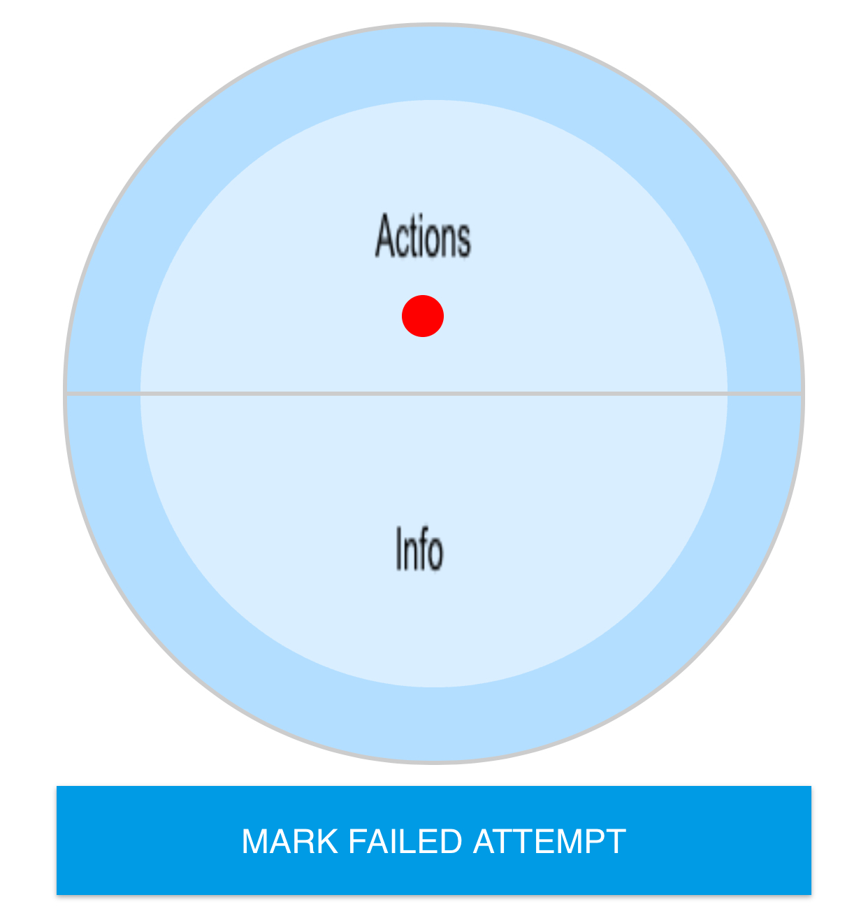

# Tilt Menu [Thalmic Labs Challenge]

I kept track of the time it took me to create this prototype and it was less than 12 hours split between 3 days. I used Javascript for this application to develop it fast on web by eliminating compile time and any other setup required. It is fast to make changes and can run on many devices. It has been  very interesting challenge.

## Requirement

This study was designed to work with a screen size of the iphone 8.
Run it on other devices to see if the UI is suitble.

## Deploying

- Since it is power by web, it is alredy deployed, hosted by firebase.
- Visit https://thalmic-challenge.firebaseapp.com/ to use the tilt menu study application
- You can also run this application locally by executing `firebase serve` while in the base directory.

## Conducting Study

- Lay phone flat making sure the indicator dot is red and select the zones you want to study

- Let the user know they have to tilt the phone and place the indicator in the darker blue zone.
- Let the user know that the indicator will turn blue and that the have to hold it there for about 2 seconds for it to register  selection.
- When the indicator is green the time will begin recording

- Now ask the user to begin by telling then which menu they need to navigate to. 
Example: Actions, Send, Stats, *Pulse
Note: * is the final destination
- When the indicator is green the time will begin recording

- When they complete the study, they will see a prompt.

- When user selects the wrng option, click "*MARK FAILED ATTEMPT"* and this will kick tem back one menu level and they can continue. This failed attempet will be reflected in the study recorded data in the end.


## Download Study Data [JSON]

- Go to the following link on the browser to get all completed study data. https://thalmic-challenge.firebaseio.com/studies.json?auth=NuViTOynUgUomK6LruUieqiJkecZQ0STCiqspNnw

Example:
```
{
  ...
  ,
  "Fri Jun 08 2018 19:01:27 GMT-0400 (EDT)": {
      "TimeToActions": 2,
      "TimeToCalendar": 3,
      "TimeToChange": 3,
      "TimeToFinal": 3,
      "TimeToInfo": 11,
      "WrongOptionActions": true
  },
  ...
}
```

Note: The time is in seconds